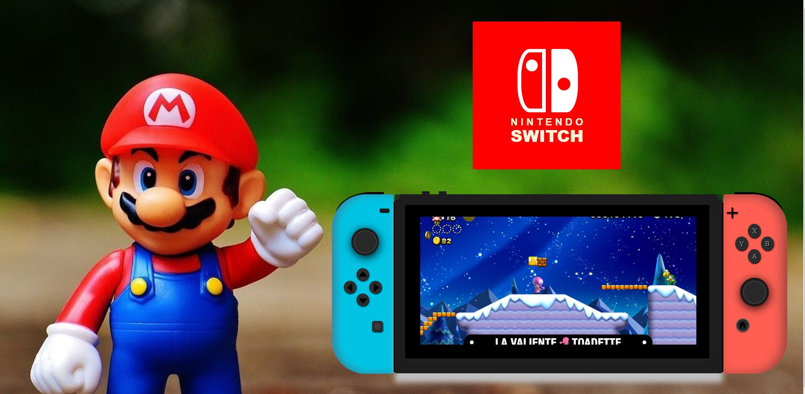

# Consola nintendo switch con su logotipo

## Índice
* Descripción del proyecto

* Estado del proyecto

* Características de la aplicación y demostración

* Acceso al proyecto

* Tecnologías utilizadas

* Personas Contribuyentes

* Personas-Desarrolladores del Proyecto

* Licencia

* Conclusión
  
### Descripción del proyecto
Proyecto desarrollado para la primera entrega de proyectos del bootcamp geekshubsacademy el cual consiste en la realización de una nintendo switch asi como el propio logo de nintendo sin la utilización de imagenes para ello. 

La consola permite separar las diferentes partes de la misma asi como la visualizacion de un video de super mario deluxe.

### Estado del proyecto
Proyecto Finalizado
### Características de la aplicación y demostración
*Funcionalidad 1: Posibilidad de separar ambos joycons de su posicion hacia arriba mediante una translación

*Funcionalidad 2: Posibilidad de desplazar la pantalla fuera de la zona junto a los joycons mediante una translación.

*Funcionalidad 3: Reproducción de video mp4 en la panatalla principal de la consola.

*Funcionalidad 4: Efecto de pulsacion en todos los botones de la consola a excepción de los joysticks izquierdo y derecho.

*Funcionalidad 5: Efecto de desplazamiento similar al que se tendria si se estuviera jugando a la consola en ambos joysticks.
### Acceso al proyecto

### Tecnologías utilizadas
* HTML 5
* CSS
* BOOTSTRAP
### Personas Contribuyentes
Usuario de github: solsona1008 (único contribuyente al proyecto)
### Licencia
MIT License
### Conclusión
Se logró plantear y elaborar el objetivo propuesto de la creación de una consola nintendo switch con ciertas funcionalidades en un periodo de tiempo concreto. En él se abordaron los principales aspectos del proyecto como que todo componente se realizara mediante las tecnologías de HTML y CSS, asi como las diferentes funcionalidades de la misma.

Se logró identificar los principales problemas de diseño, y abordarlos de manera adecuada para que estuviesen correctamente ejecutadas todas las funcionalidades previstas en el diseño base del proyecto.
